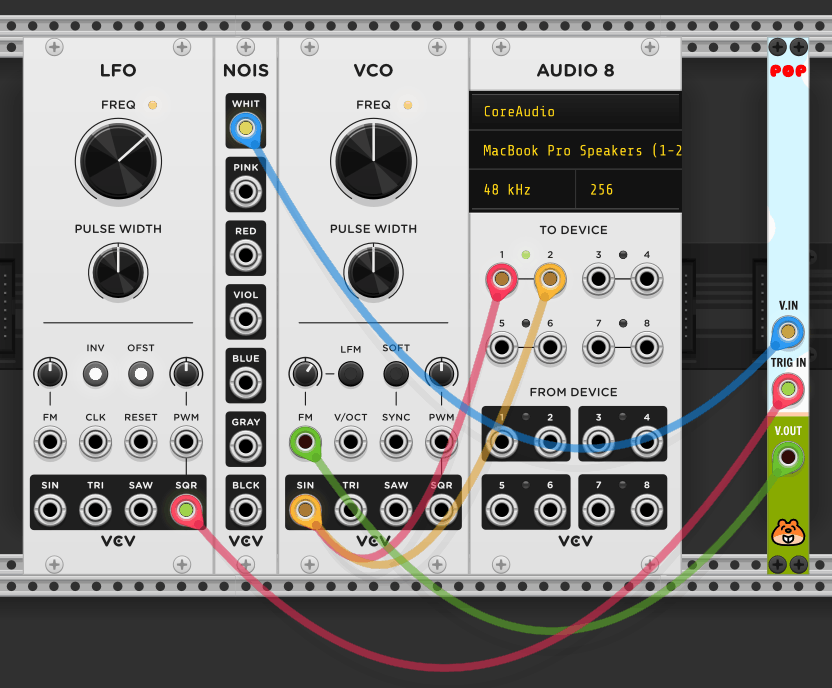

# Chortling Hamster's Modules for VCV Rack

Here are some modules for [VCV Rack](https://www.vcvrack.com). Well, _module_, as there's only one so far. And that's nothing too amazing. Enjoy!

## Pop

Pop is a _very_ simple trigger-based [sample and hold](https://en.wikipedia.org/wiki/Sample_and_hold) module. (It's my first module! I'm so excited!)

### How does it work? What do I do? I is confused!

* Add Pop to your totally brilliant VCV Rack patch.
* Connect a control voltage, such as the _SIN_ output from a [Fundamental](https://vcvrack.com/Fundamental.html) LFO-1 module, to the _in_ port.
* Connect a trigger, such as the _SQR_ output from another Fundamental LFO-1 module, to the _trig_ port.
* Connect Pop's _out_ port to a control voltage input on another module, such as the Fundamental VCO-1 module.

Every time Pop's _trig_ port is, er, triggered, the control voltage value from the _in_ port will be sampled and held until the next trigger comes along, and the current held voltage value will be sent through the _out_ port for you to do amazing things with. Huzzah!

Here's a screen shot of a VCV Rack patch using Pop _to do just that_! Cripes!

You can find that patch in the folder `/res/patches` as a file called `Pop-Example.vcv`.

### Disappointment! This is serious basic!

Yes. It is. I totally agree. I only made it to help me learn how to get started making modules for VCV Rack.

That said…

__IT'S A SAMPLE AND HOLD MODULE WITH A CHORTLING HAMSTER ON THE PANEL!!!!!1!1__

Enjoy.

## I am having an issue

Sorry. Please raise the issue as an issue on the issue thing on GitHub and I'll see what I can do to fix it. Thanks. :)
