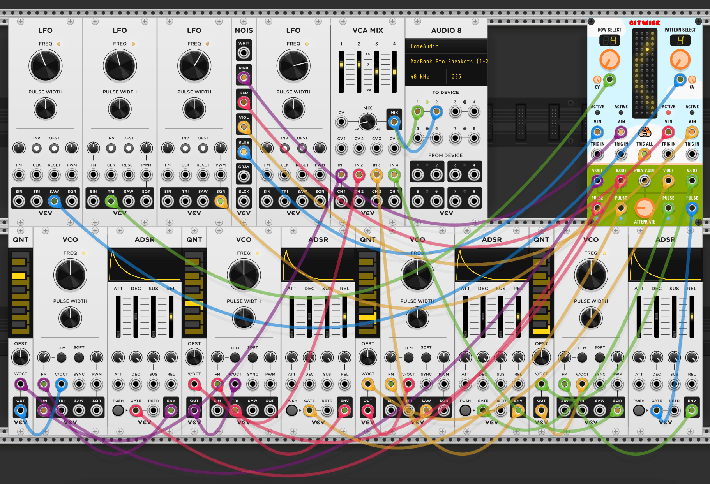

# Chortling Hamster's Modules for VCV Rack

Here are some modules for [VCV Rack](https://www.vcvrack.com).

1. Pop. A small sample and hold module. One input, one trigger and one output. But it has a chortling hamster on it!
2. Bitwise. Four sample and hold circuits whose triggers can be affected by CV controlled patterns.

## Pop

Pop is a _very_ simple trigger-based [sample and hold](https://en.wikipedia.org/wiki/Sample_and_hold) module. (It was my VCV first module! I was _soooo_ excited!)

### How does Pop work? What do I do? I is confused!

* Add Pop to your totally brilliant VCV Rack patch.
* Connect a control voltage, such as the _SIN_ output from a [Fundamental](https://vcvrack.com/Fundamental.html) LFO-1 module, to the _in_ port.
* Connect a trigger, such as the _SQR_ output from another Fundamental LFO-1 module, to the _trig_ port.
* Connect Pop's _out_ port to a control voltage input on another module, such as the Fundamental VCO-1 module.

Every time Pop's _trig_ port is, er, triggered, the control voltage value from the _in_ port will be sampled and held until the next trigger comes along, and the current held voltage value will be sent through the _out_ port for you to do amazing things with. Huzzah!

Here's a screen shot of a VCV Rack patch using Pop _to do just that_! Cripes!

### Disappointment! Pop is serious basic!

Yes. It is. I totally agree. I only made it to help me learn how to get started making modules for VCV Rack.

That said…

__IT'S A SAMPLE AND HOLD MODULE WITH A CHORTLING HAMSTER ON THE PANEL!!!!!1!1__

Enjoy.

## Bitwise

Bitwise features four sample and hold modules whose triggers can be controlled by a CV controlled "pattern filter".

### How the "pattern filter" works

Using the pattern filter you can control if a sample and hold trigger is fired or not.

Bitwise has eight preset patterns, which you can select using the Pattern Select knob. You can also control which pattern is selected by CV.

You can select which row in the current pattern is selected using the Row Select knob and, as with the pattern selection, you can control which row is selected by CV.

The number of the selected row and pattern you have selected is displayed above their respective parameter knobs. Note that this is the number _after_ any CV has been applied.

If a trigger is fired when a sample and hold "column" is "active" in the current pattern's row, indicated by the ACTIVE light showing red, the trigger will be "let through" and the sample and hold function will be carried out.

So, [trigger in] + [column is active] = [sample and hold done].

The held voltage from the sample and hold operation is sent to that column's V.OUT port, and a "pulse" is sent to that column's PULSE port.

Here's a screen shot of a VCV Rack patch using Bitwise _to do just that_! Cripes!

### Trigger all port

There is also a "trigger all" input, which sends its trigger to all the sample and hold "columns".

Note that if you have a trigger plugged in to an individual trigger input, the trigger all input will be ignored for that column.

### "Pulses" versus gates

The pulse can be used to trigger envelope generators, but please note that as the "pulse" is only a hundredth of a second long it can't be used as a "gate" input.

This means you won't get a "sustain" phase in your envelope.

However, this can be got around by using an envelope generator which has a "hold" stage, which would then give you sustain.

### Global voltage output attenuator

Bitwise includes a global voltage output attenuator knob. You can use this to reduce the range of the output voltages.

### Polyphonic output port

Bitwise also has a polyphonic output port. This outputs all four V.OUT values through the POLY output port.

## Example patches

You can find example patches for Pop and Bitwise in the the `res/patches` folder.

## Having an issue over here!

Sorry. Please raise the issue as an issue on the issue thing on GitHub and I'll see what I can do to fix it. Thanks. :)

## Thanks

Thanks must go to Andrew Belt for making VCV Rack and the wonderful Rack SDK.

Also many thanks to beta testers and other module authors who made their code open source so I could figure out how to add custom knobs. Unfortunately, not rotating hamster knobs at this moment in time. ;)
